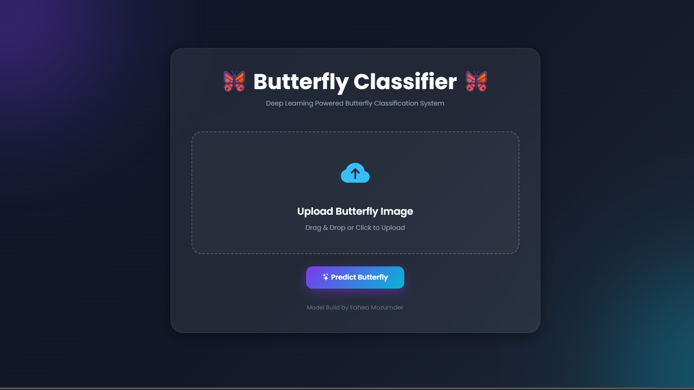
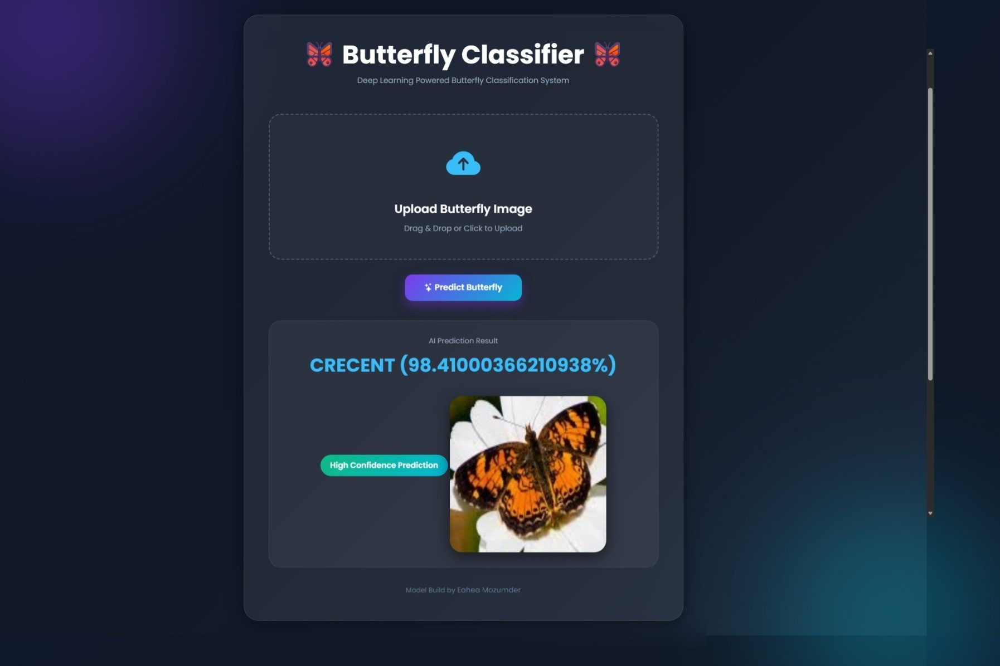
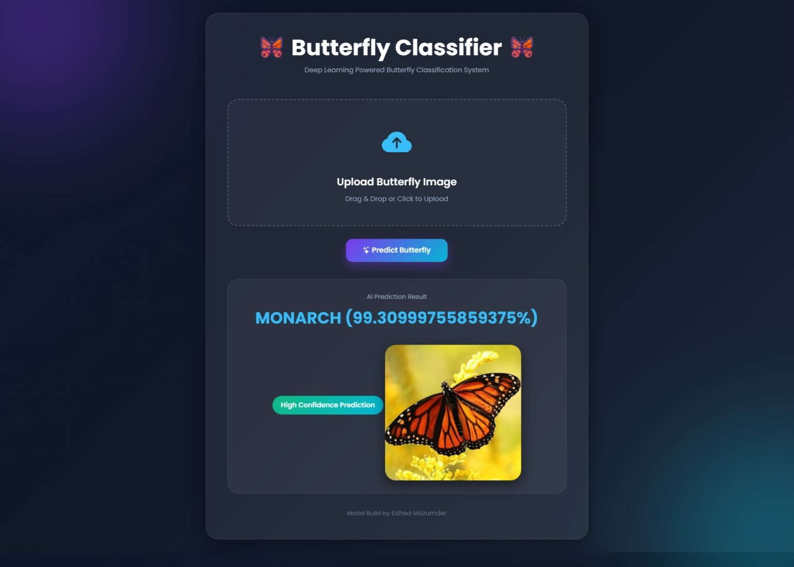

# 🦋 Butterfly Image Classification using Deep Learning (CNN + Flask)

## 🚀 Project Overview

This project is a **Deep Learning-based Image Classification System** that identifies different species of butterflies using a **Convolutional Neural Network (CNN)**.
The trained model is deployed using a **Flask web application** with a modern UI where users can upload images and get real-time predictions.

---

## 🎯 Features

* 🧠 CNN-based image classification model
* 📸 Upload butterfly images for prediction
* ⚡ Real-time inference using Flask API
* 🎨 Premium modern UI (Bootstrap + Glassmorphism)
* 📊 Prediction with confidence score
* 📁 Easy model saving & loading
* 📱 Fully responsive web interface

---

## 🛠️ Tech Stack

* Python 🐍
* TensorFlow / Keras 🤖
* Flask 🌐
* NumPy & Pandas 📊
* Scikit-learn 📈
* HTML, CSS, Bootstrap 🎨

---

## 📁 Project Structure

```
butterfly-app/
│
├── app.py                  # Flask backend
├── butterfly_model.h5      # Trained CNN model (Download from Google Drive)
├── class_names.json        # Class labels
├── requirements.txt
│
├── static/
│   └── uploads/            # Uploaded images
│
├── templates/
│   └── index.html          # Frontend UI

```

---

## 🧠 Model Architecture

The CNN model consists of:

* Conv2D (32 filters) + ReLU
* MaxPooling2D
* Conv2D (64 filters) + ReLU
* MaxPooling2D
* Conv2D (128 filters) + ReLU
* MaxPooling2D
* Flatten layer
* Dense (512 neurons)
* Output layer (Softmax for multi-class classification)

---

## 📦 Installation

1. Download the repository
2. Run the Project
3. Then open in browser

---

---

## 📸 How It Works

1. Upload a butterfly image 🦋
2. Flask API processes the image
3. CNN model predicts the class
4. Result + confidence score is displayed

---

---

## 📊 Example Output

```
Predicted Class: Monarch Butterfly
Confidence: 99.30%
```

---

---

## 🧪 Model Performance

* Accuracy: ~70%+ (baseline CNN)
* Can be improved using Transfer Learning
* Evaluated using:

  * Classification Report
  * Confusion Matrix

---

## 📌 Requirements

```
flask
tensorflow
numpy
pillow
scikit-learn
matplotlib
```

---

## 👨‍💻 Author

**<a href="https://www.linkedin.com/in/md-eahea-mozumder/">Eahea Mozumder</a>**
💡 Passionate about AI, Machine Learning & Web Development

---

## ⭐ Support

If you like this project:

* ⭐ Star the repo
* 🍴 Fork it
* 🧠 Improve it

---
